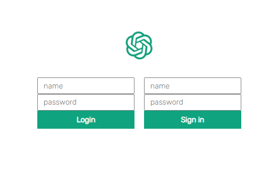
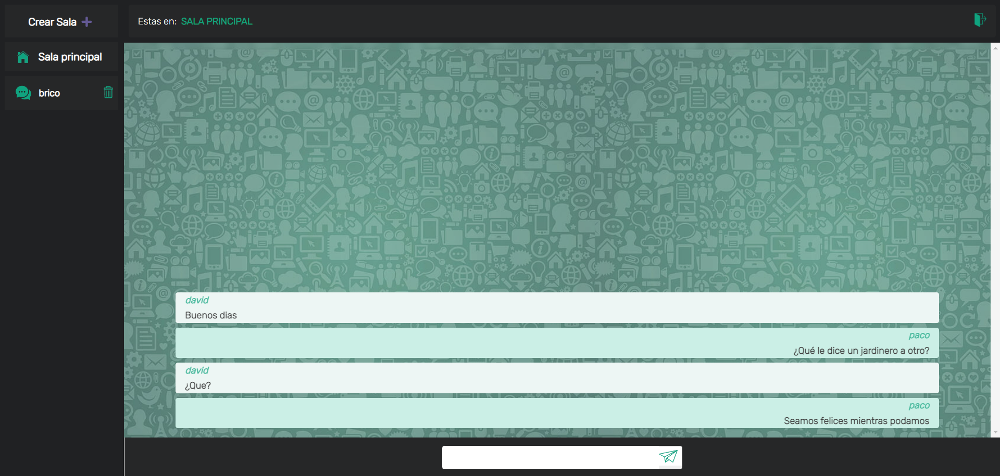

# FRONTEND

Client server deveopled with React and based on React-redux to handle the app state.

## Login

Here starts the app:

<small>Sign in and log in form.</small>

After sign in we can proceed to log in.

Have in mind the form will only accept letters and numbers. No repetead names will be allowed.

## Chat

<small>How the app looks</small>

A web token is generated and stored at the localstorage. Each time we navigate through rooms the token will be verified.
If token resaults in any error or invalid the user wil be redirected to log in page.

At the left column we can create and see the rooms.
Only the room creator will be allowed to delete his room as long as it is empty. If disconnected with users inside
the ownership will be passed on to the next user who enetered the room.

## Structure

* __Components__ 
    *   Each components has his own js and css file
* __Context__ Where I handle the state of the application
* __Img__  Middlewares for authentication, validation and cypher the passwords. 
* __Index.js__

